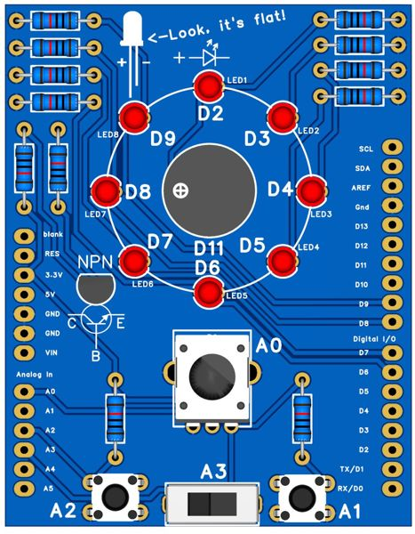
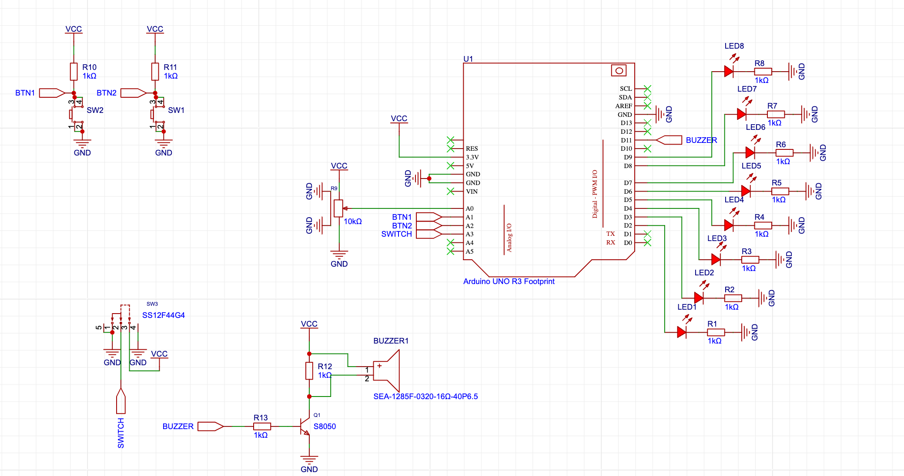

# PracticeShield

Soldering and programming practice shield

You can grab [the manufacturing files or directly order a PCB from PCBWay here!](https://www.pcbway.com/project/shareproject/Practice_Shield_f079cca5.html)

## User manual

The code, variables, comments will all be in English. The project files are located in the `code` folder.

However, the `hatchling` level boards are aimed to be usable from age 10, so translations are very welcome! The baseline is the English - `en`.

## Schematic

Of course, a schematic is available. The board is not complicated, but a few things I want to point out: the board is 3.3V main. All the pins, buttons, etc. are limited to this for compatibility reasons. The "regular" Arduino Uno R3 works with 5V signals, and the R4 also works with 5V signals. Most Arm based microcontrollers only tolerate 3.3V IO signals, so it may be compatible with more Arduino shaped devboards.

Also, the analog voltage on A0 goes from 0V to 3.3V, while the default reference is 5V. Again, it may limit the range, but won't fry "regular" microcontrollers - better safe than sorry!

## BOM

This board uses TH/THT parts only.

The following parts are needed:
- 12x 1k resistor
- 8x 3mm red LED
- 2x pushbuttons/switches, 6x6x7mm SPST-NO tactile
- 1x slide switch, SPDT, SS12
- 1x potentiometer, 10k, linear
- 1x NPN bipolar transistor, S8050
- 1x passive buzzer, 6.5mm lead spacing, 12.5mm diameter
- 1x 40 pin header, male

Required tools for assembly:
- soldering iron, solder
- flush cutter/plier

An Arduino Uno is highly recommended. Both Uno R3 and Uno R4 are fine!

### Resistors

12 x 1kΩ, Ø2.5x6.8mm, carbon or metal film.

Practically ANY "regular" 1k resistor is usable. 0.6W, 0.4W and even the tiny 0.25W resistors are fine, because not much power is used. LEDs could use 330Ω resistors, but any regular red LED is bright enough with 1k. The pullup resistors are usually 10kΩ, but using 1kΩ for R10 and R11 is totally OK - they conduct 4mA tops! This way the design only uses a single value.

### Tactile switches/pushbuttons

4.5x6.5mm raster.

Compatible parts:
- TVDP01-070AB1

### LEDs

3mm, round red LEDs with 0.1"/2.54mm lead spacing is selected, but you can use different colors and sizes too! Just match the lead spacing and have enough space for your LED.

### Slide switch

Regular SPDT switch, straight, 3 pins, 3mm pin pitch.

Compatible parts:
- SS12F44G4

### Potentiometer

Compatible parts:
- Alps Alpine RK09K11 series
    - RK09K1130AV7
    - RK09K1130AJ3
    - RK09K1130AAU
    - RK09K1130BM4
- Alps Alpine RK09D11 series
    - RK09D1130C2P
    - RK09D117000C
- SR Passives R9011-1 series
    - R9011-1-10K LIN

### Piezo buzzer

Strictly passive buzzers!

Max diameter: 20mm

Pin pitch: 6.5mm

Compatible parts:
- SFN-12055PA6.5
- SFN-1207PA6.5
- LD-BZEN-1205
- LD-BZEN-1212

### Transistor

A regular NPN bipolar transistor, which can drive the piezo. TO92 package.

Compatible parts:
- S8050
- SS8050
