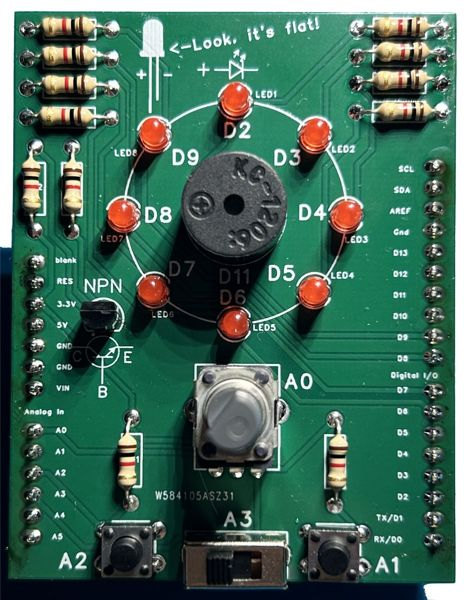

# Arduino practice shield user manual

## Assembling

Assembling steps arriving soon!

 

## Programming

To use this board as a learning tool, you can go through the examples. Each one has a `Task`, some `Explanation`, and 100% working, tested code too!

It's recommended to read the documentation first and try to solve the challenge by yourself. Please check the solution if you have your own working version or got stuck.