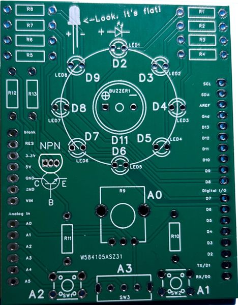
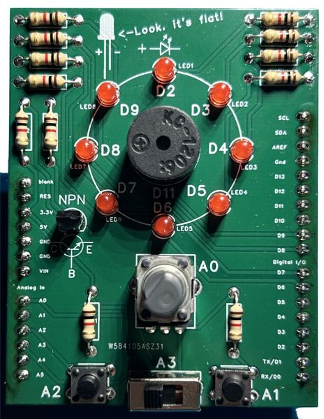

# Arduino gyakorlópanel - felhasználói útmutató

## Összeszerelés

[A videót ide kattintva érheted el.](https://youtu.be/ZdfeQkbDTOk)

 

## Programozás

Hogy megtanuld programozni, menj végig a mintafeladatokon. Mindegyikben van egy `Feladat` és egy `Magyarázat`, illetve egy tutibiztos 100% működőképes mintakód is!

Először próbáld meg a leírást elolvasni és magadtól megoldani. A megoldást (nagyon szépen kérlek) csak akkor nézd meg, ha eladakdtál, vagy kész vagy és le akarod ellenőrizni, hogy jól csináltad-e!
